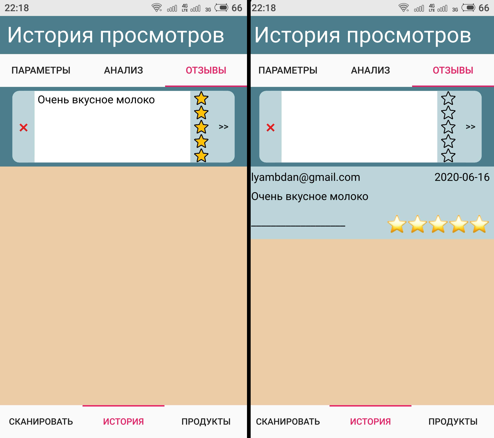

# product_helper
Bachelor project. Android Qt/Qml application that grants consumer to buy better food products.
  
<b>You can scan product and get bit of useful information about it (if it exists in database ;D).</b> 
<ul>
<li><b>NOVA</b> - a <a href="https://world.openfoodfacts.org/nova">classification</a> in 4 groups to highlight the degree of processing of foods </li>
<li><b>NUTRISCORE</b> - <a href='https://world.openfoodfacts.org/nutriscore'>logo</a> that shows the nutritional quality of food products</li>
<li><b>USER RATING</b> - average user rating based on feedbacks</li>
<li><b>AVG</b> - average of all other characteristics listed above</li>
</ul>
 

<b>You can watch full information about product. History of scanned products is also available.</b>
 <b>Sources of information:</b>
<ul>
<li><b><a href='https://github.com/papyrussolution/UhttBarcodeReference'> UhttBarcodeReference</a></b></li>
<li><b><a href='https://world.openfoodfacts.org/'>Open Food Facts</a></b></li>
<li><b><a href='https://rskrf.ru/'>Роскачество</a></b></li>
</ul>
  

<b>You can search for product on server database.
 Search is based on product category and some additional parameters.
 Some of them are individual for each category </b>
    
  

<b>And you can share your opinion with others by writing your feedback about product with your Google account.</b>
    
